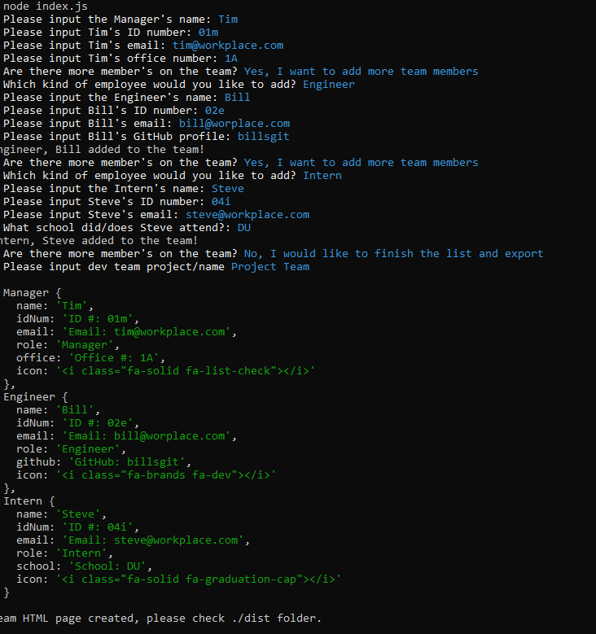
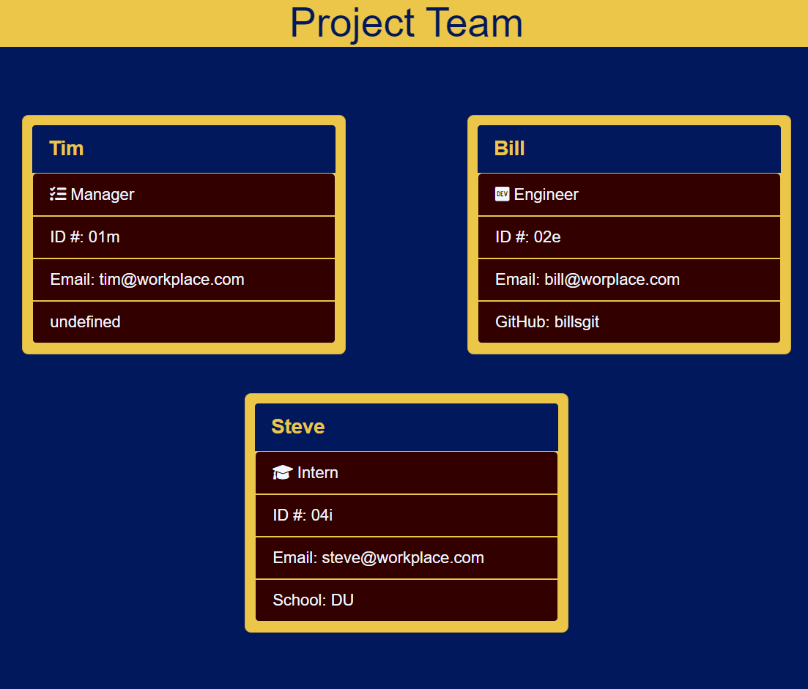

# Team_Profile_Generator

## Link:https://github.com/eeoerkeedu/Team_Profile_Gererator

## Description

An application to generate an html page with helpful information on team members.

## Table of Contents

- [Installation](#installation)
- [Usage](#usage)
- [License](#license)
- [How to Contribute](#Contribute)
- [Tests](#tests)
- [Questions](#questions)

## Installation

Application uses npm 'inquirer' and npm 'jest'. After cloning down, run 'npm i' from the command line to get these modules installed and run the program.

## Usage

To initiate the program, run 'node index.js' fro mthe command line. Then answer the prompts for your team members. Once you have added all the necessary team members, choose to generate the HTML and it will push the input to a HTML named after the team within the ./dist folder.

## Screen Shots

## Video Tutorial

https://drive.google.com/file/d/1cbE4mgWY0bbPuZr0net_JdFuRYIbo5Yc/view

## License

This project is licensed under MIT

For details visit https://choosealicense.com/licenses/mit/

## Contribute

tbd

## Tests

npm test

## Questions

Find an issue or have a question? Contact me via email eeoerkeedu@gmail.com.
If you liked what you found, you can view more of my projects at:
https://github.com/eeoerkeedu.
